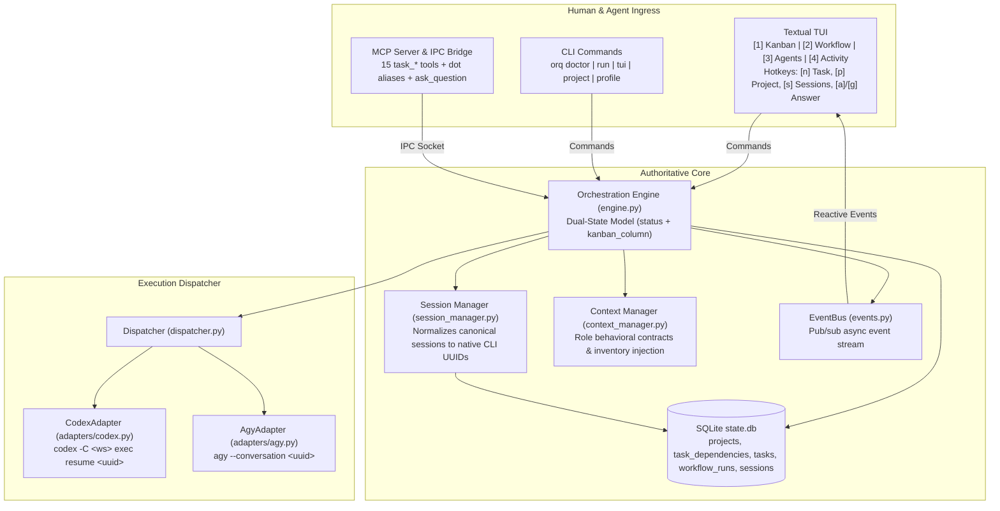

# Agent Handoff Document: ORQ Multi-Agent Orchestration Runtime

**Generated**: 2026-09-24T17:55:00+08:00  
**Target Repository**: `git@github.com:tantan2395/orq-cli.git`  
**Current Branch**: `main`  
**Latest Commit**: `d211e5d` (`feat(sessions): add native session reuse via CLI flags, YAML config, and TUI modal`)  
**Test Suite**: 63 passing unit and integration tests (`uv run pytest -v`)  

---

## 1. Executive Summary

**ORQ** (`orq-cli`) is a local, lightweight multi-agent orchestration runtime designed to pair-program and automate software engineering workflows by coordinating native AI coding agent CLIs—specifically **Codex** (OpenAI) and **Agy** (Antigravity).

ORQ provides:
1. **First-class Project Management** separating Projects, Workflow Runs, and Agent Sessions.
2. **Authoritative Dual-State Engine** with SQLite persistence, enforcing task dependencies and cycle detection.
3. **Reactive Textual TUI** featuring a 6-column Kanban Board, stage DAG visualization, agent session monitor, activity logs, and human-in-the-loop Direct Chat.
4. **Interactive Grill-Me Prompts** enabling agents to pause and prompt human operators with single-choice, multi-select, and write-in forms.
5. **Native Session Reuse** enabling developers to seed existing Codex rollout UUIDs and Agy conversation UUIDs into specific roles without cold-starting context.

---

## 2. Architectural Blueprint



---

## 3. Core Conceptual Model & Separation of Concerns

It is critical to maintain the explicit separation among these entities:

1. **PROJECT** ([`src/orchestrator/models.py`](file:///home/tantan/Projects/orq-cli/src/orchestrator/models.py#L90-L105)):
   - Represents a persistent codebase/workspace root on disk.
   - Identified by a slug `id` (e.g. `famas-desktop`), human name, `workspace_root`, `default_workflow`, and `status` (`active` vs `archived`).
   - Project source files are **never** duplicated or copied into ORQ's metadata directory.
2. **WORKFLOW RUN** ([`src/orchestrator/models.py`](file:///home/tantan/Projects/orq-cli/src/orchestrator/models.py#L65-L88)):
   - One discrete execution of a workflow against a project.
   - Tied to a `project_id`, contains a DAG of stages, and transitions through `running`, `paused`, `completed`, `failed`, or `cancelled`.
3. **AGENT SESSION** ([`src/orchestrator/models.py`](file:///home/tantan/Projects/orq-cli/src/orchestrator/models.py#L125-L138)):
   - A native Codex rollout or Antigravity conversation associated with an agent's work.
   - Mapped by [`SessionManager`](file:///home/tantan/Projects/orq-cli/src/orchestrator/session_manager.py) to a `native_session_id`.
   - Seeded context is optional; sessions are not hardcoded dependencies.

---

## 4. Key Subsystems & Recent Implementations

### A. Dual-State Kanban Task Board & Dependency Engine
- **Orthogonal State Model**:
  - `status`: Execution lifecycle (`queued`, `running`, `completed`, `failed`, `cancelled`).
  - `kanban_column`: Authoritative visual column (`backlog`, `ready`, `in_progress`, `review`, `blocked`, `done`).
- **DAG Dependency Graph**:
  - Persisted in SQLite table `task_dependencies`.
  - Enforces:
    - Rejection of self-dependencies (`task_id == depends_on_task_id`).
    - Rejection of cross-run dependencies.
    - Cycle detection via Depth-First Search (DFS) reachability traversal.
- **Dynamic Promotion**:
  - When `task_start` is requested on a task with unsatisfied prerequisites, the engine marks it `kanban_column = "blocked"` and rejects execution.
  - As soon as a blocking task transitions to `completed`, the engine automatically scans downstream dependents and promotes eligible `blocked` tasks to `ready`, publishing a reactive `task_ready` event.

### B. 15-Tool MCP Suite + `ask_question`
Registered in [`src/orchestrator/mcp/server.py`](file:///home/tantan/Projects/orq-cli/src/orchestrator/mcp/server.py) and bridged over Unix Domain Socket IPC:
- **Task CRUD**: `task_create`, `task_get`, `task_list`, `task_update`, `task_delete`
- **Task Lifecycle**: `task_start`, `task_complete`, `task_cancel`, `task_block`, `task_unblock`
- **Task Dependencies**: `task_add_dependency`, `task_remove_dependency`, `task_dependencies`, `task_dependents`, `task_ready`
- **Human-in-the-Loop Question**: `ask_question`
  - Pauses the workflow run.
  - Emits a `question_asked` event.
  - Automatically pops up the [`QuestionModal`](file:///home/tantan/Projects/orq-cli/src/orchestrator/tui/modals.py) in the TUI, supporting single-choice (`RadioSet`), multi-select (`Checkbox`), and write-in text (`Input`).

### C. Native CLI Session Reuse (Codex & Agy)
Allows operators to attach or resume existing native agent sessions:
- **CLI Flags**:
  - `orq tui --codex-session <uuid> --agy-session <uuid>`
  - `orq tui --session decision_maker=<uuid> --session developer=<uuid>`
  - Same flags available for headless `orq run`.
- **In-TUI Modal**:
  - Press <kbd>s</kbd> (or click **`Sessions [s]`**) at any time.
  - Opens [`AttachSessionModal`](file:///home/tantan/Projects/orq-cli/src/orchestrator/tui/modals.py) to bind or switch a native session ID for any role on the fly.
  - Updates SQLite and in-memory session mappings immediately.
- **Declarative YAML**:
  - Configurable via `seed_session_id` on any role in `orchestrator.yaml`.
- **Command Invocation**:
  - Codex Adapter: `codex -C <workspace_root> exec resume <session_id> ...`
  - Agy Adapter: `agy --conversation <session_id> ...`

---

## 5. Important Operational Nuances & Invariants

> [!IMPORTANT]
> **Project Switching during Active Runs**:
> An `orq tui` process hosts a single orchestrator execution loop. If an agent turn is actively executing (subprocesses running on disk), switching projects without pausing creates a state mismatch. Operators must **pause first** (<kbd>Space</kbd>) before switching projects with <kbd>p</kbd>, or run independent instances in separate terminal windows (`orq tui --project <name>`).

> [!NOTE]
> **Codex CLI CLI Flag Placement**:
> In Codex CLI, the `-C <workspace_root>` option MUST be placed before the subcommand: `codex -C <dir> exec resume <id>`, NOT after `resume`. This is handled in [`src/orchestrator/adapters/codex.py`](file:///home/tantan/Projects/orq-cli/src/orchestrator/adapters/codex.py#L28).

> [!NOTE]
> **Textual Logging Invariant**:
> Textual's `RichLog.write()` does NOT accept `markup=False`. When writing raw text from agents that may contain brackets or code blocks, wrap the content in `rich.text.Text(content)` to avoid `TypeError` or markup parsing crashes.

---

## 6. Project Structure Overview

```
orq-cli/
├── orchestrator.yaml              # Global default configuration (workflows, roles, profiles)
├── pyproject.toml                 # Dependencies (textual, aiosqlite, mcp, pydantic, rich)
├── prompts/                       # Role behavioral contracts
│   ├── decision_maker.md          # Strategy and orchestration lead prompt
│   ├── developer.md               # Implementation slice prompt
│   └── reviewer.md                # Verification gate prompt
├── src/orchestrator/
│   ├── __init__.py
│   ├── cli.py                     # Entrypoint & CLI parsers (doctor, run, tui, project, profile)
│   ├── config.py                  # YAML loader and config models
│   ├── context_manager.py         # Prompt assembly, role contracts, tool inventory injection
│   ├── db.py                      # SQLite persistence (aiosqlite)
│   ├── dispatcher.py              # Turn resolution & execution delegation
│   ├── doctor.py                  # 4-level capability diagnostics
│   ├── engine.py                  # State machine & IPC command handlers
│   ├── events.py                  # In-memory pub/sub EventBus
│   ├── models.py                  # Pydantic data schemas
│   ├── runner.py                  # Headless workflow execution runner
│   ├── session_manager.py         # Canonical-to-native session mapping & persistence
│   ├── adapters/
│   │   ├── base.py                # Abstract AgentAdapter
│   │   ├── codex.py               # OpenAI Codex CLI adapter
│   │   └── agy.py                 # Antigravity (Agy) CLI adapter
│   ├── mcp/
│   │   ├── ipc.py                 # Unix domain socket IPC client & server
│   │   └── server.py              # MCP server exposing task_* & ask_question tools
│   └── tui/
│       ├── app.py                 # Textual application, layout, and reactive loop
│       ├── kanban.py              # KanbanBoard, KanbanColumn, TaskCard widgets
│       └── modals.py              # QuestionModal, AttachSessionModal, TaskDetailModal, etc.
└── tests/                         # 63 automated tests covering all modules
```

---

## 7. Verification Commands

To verify the entire environment and test suite:

```bash
cd /home/tantan/Projects/orq-cli

# Run capability diagnostics
uv run orq doctor

# Run full automated test suite
uv run pytest -v

# Launch the interactive TUI
uv run orq tui
```

---

## 8. Suggested Future Enhancements for Incoming Agent

1. **Auto-Pause on Project Switch**:
   In `src/orchestrator/tui/app.py`, update `_switch_project` to automatically pause the current project's workflow run if `running`, switch `self.workspace_root` to `proj.workspace_root`, and load the target project's latest workflow run into the active TUI state.
2. **Task Drag-and-Drop or Column Move in TUI**:
   Add keyboard shortcuts (<kbd>h</kbd>/<kbd>l</kbd> or arrow keys) in the Kanban view to manually move a card between columns (`ready` $\leftrightarrow$ `in_progress` $\leftrightarrow$ `review`).
3. **Multi-Project Workspace View**:
   Extend the TUI to optionally display runs across multiple registered projects in an overview dashboard.
